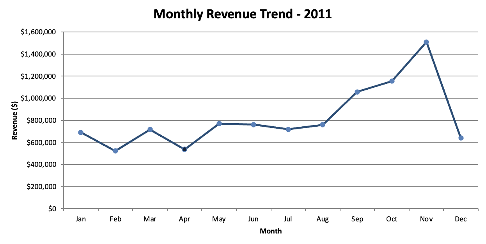
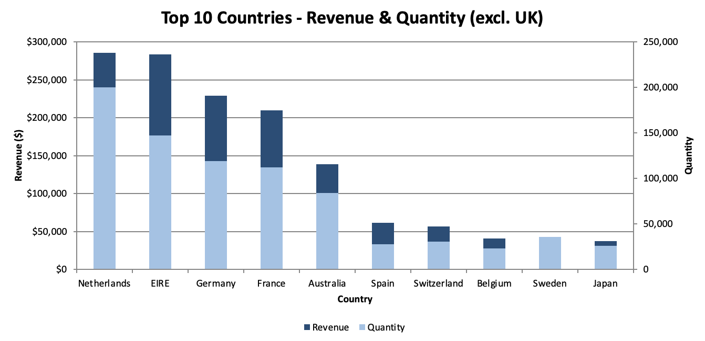
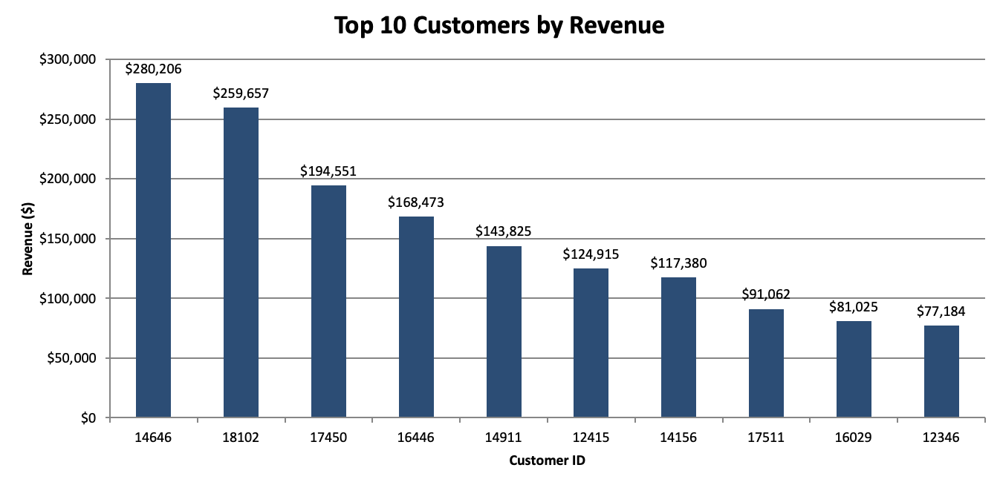
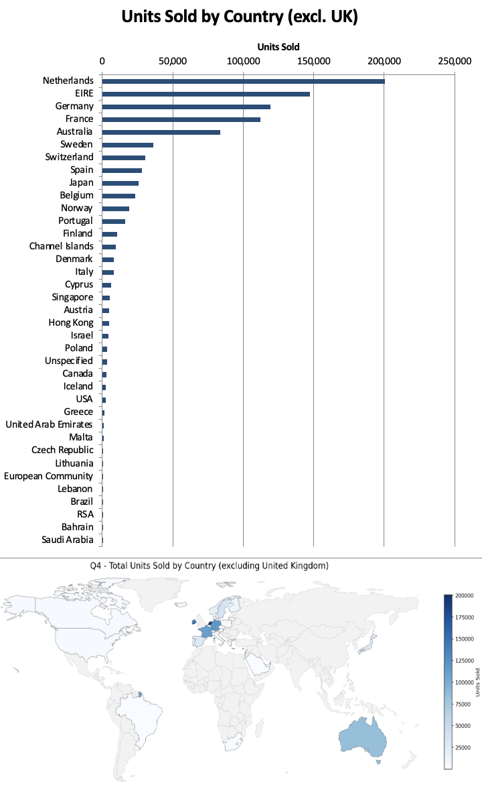

# Tata iQ – Data Visualisation Job Simulation (Forage)

**Author:** Fariba Kazi · **Tools:** Excel

Completed the Tata iQ (Tata Insights & Quants) Data Visualisation virtual job
simulation on Forage, acting as a consultant analysing an online retail store's
transaction data (~542,000 records) to give the CEO and CMO insights for a
market-expansion decision.

---

## Task 1 — Business Framing
Wrote eight targeted questions — four for the CEO, four for the CMO — anticipating
what each executive needs and separating the operational lens from the marketing
lens. See [the eight questions](Task1_Business_Questions.pdf).

## Task 2 — Chart Selection
Matched each business question to the visualisation that answers it best, based on
the underlying data relationship: line for trends, clustered bar for category
comparison, column for ranking, map for geographic demand, boxplot for distribution.

## Task 3 — Data Cleaning & Visualisation
Cleaned the dataset by removing returns (negative quantities) and price-entry errors
(unit price ≤ 0) — ~11,800 bad records dropped, leaving ~530,000 — and added a
calculated **Revenue** field (Quantity × Unit Price). Built formula-driven (SUMIFS,
INDEX/MATCH/LARGE, SUMPRODUCT) rather than hardcoded.

**Visuals built:**
- 2011 monthly revenue line chart → autumn seasonal peak (~$1.5M in November)
- Top-10 countries excluding the UK → Netherlands, Ireland, Germany, France leading
- Top-10 customers column chart, sorted descending
- Units-by-country map for expansion targeting

See `Tata_Online_Retail_Visuals.xlsb`.

## Task 4 — Communicating Insights
Delivered a ~5-minute presentation to the CEO and CMO covering the full process —
data load, cleanup, the four findings, and an expansion recommendation. See [the
presentation script](Task4_Presentation_Script.pdf).

---

## Key Insights
- Strong autumn seasonality, peaking in November
- Netherlands and Ireland are the top non-UK markets and lowest-risk expansion targets
- Sales concentrated in Western Europe — whitespace in the Americas, Asia, and Africa
- Customer base is relatively evenly spread, not dangerously concentrated

## Key Visuals

**Monthly revenue, 2011** — revenue climbs from September to an autumn peak (~$1.5M in November).

**Top 10 countries (excl. UK)** — Netherlands and Ireland lead on both revenue and volume.

**Top 10 customers** — high-value accounts ranked by revenue, led by one ~$280K customer.

**Units sold by country** — demand map highlighting Western Europe as the expansion shortlist.

## Recommendation
- **Priority 1: Netherlands & Ireland** — top non-UK markets by revenue and volume; lowest-risk expansion targets.
- **Priority 2: Germany & France** — proven Western European demand; strong second-wave candidates.
- **Protect key accounts** — retain top customers while broadening the base to reduce concentration risk.
- **Prepare for the autumn peak** — scale inventory, staffing, and marketing ahead of the November surge.

---

## Skills
Data cleaning · Data analysis & interpretation · Data visualisation · Dashboard
building · Stakeholder communication · Translating data into recommendations
